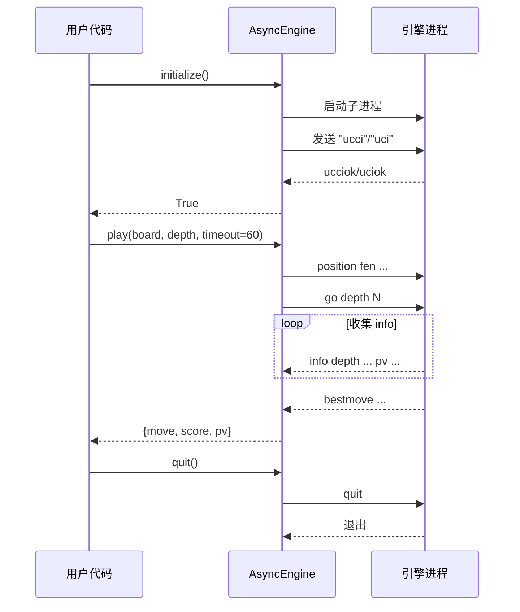

# CChess 项目代码架构分析报告

## 1. 整体架构概览

CChess是一个用Python实现的中国象棋库，采用**模块化、面向对象**的设计架构。项目遵循**单一职责原则**，将不同功能分离到独立的模块中。

### 核心架构特点：
- **分层架构**：基础数据层 → 业务逻辑层 → 应用层
- **面向对象设计**：使用类继承和多态实现棋子行为
- **模块化设计**：功能模块高度内聚，低耦合
- **性能优化导向**：大量使用缓存、直接数组访问等优化技术

## 2. 核心模块架构

### 2.1 基础核心模块

```cchess/src/cchess/board.py#L80-120
class ChessBoard:
    """棋盘核心类：存储棋子分布并提供走子/检测规则的工具方法。"""

    def __init__(self, fen: str = "") -> None:
        # 初始化所有实例属性
        self._board: List[List[Optional[str]]] = [
            [None for _ in range(9)] for _ in range(10)
        ]
        self._move_side = SIDE_ANY
        # 攻击矩阵缓存
        self._red_attacks: List[List[bool]] = [
            [False for _ in range(9)] for _ in range(10)
        ]
        self._black_attacks: List[List[bool]] = [
            [False for _ in range(9)] for _ in range(10)
        ]
        self._attack_matrix_dirty = True
```

**设计特点**：
- 使用10x9的二维数组表示棋盘
- 引入**攻击矩阵缓存**优化性能
- 支持**规范局面**处理红黑对称性
- 提供完整的FEN支持

### 2.2 棋子类层次结构

```cchess/src/cchess/piece.py#L80-120
# 棋子类使用工厂模式创建
# 类层次：Piece（基类） → King/Advisor/Bishop/Knight/Rook/Cannon/Pawn

# 使用__slots__优化内存使用
class Piece:
    __slots__ = ("fench", "pos", "color")

    def __init__(self, fench, pos):
        self.fench = fench
        self.pos = pos
        self.color = get_fench_color(fench)
```

**设计模式应用**：
1. **工厂模式**：`Piece.create()`根据棋子字符创建对应子类
2. **策略模式**：每个棋子子类实现自己的走法生成逻辑
3. **缓存模式**：使用模块级常量缓存棋子位置信息

### 2.3 走法表示系统

```cchess/src/cchess/move.py#L80-100
@dataclass
class MoveInfo:
    """记录棋盘移动的增量状态信息，用于撤销操作"""

    from_pos: Tuple[int, int]
    to_pos: Tuple[int, int]
    moving_fench: str  # 移动的棋子字符
    captured_fench: Optional[str]  # 被吃棋子，None 表示无吃子
    prev_move_side: int  # 移动前走子方
    next_move_side: int  # 移动后走子方
    board_before: List[List[Optional[str]]]  # 移动前棋盘数组的深拷贝
    board_after: List[List[Optional[str]]]  # 移动后棋盘数组的深拷贝

class MoveNotation:
    """走法中间表示，支持多种输出格式"""
```

**设计特点**：
- 使用**数据类**（dataclass）表示走法信息
- **中间表示层**统一处理不同格式的走法表示
- 支持**撤销操作**的增量状态记录

## 3. 架构设计模式分析

### 3.1 规范局面模式（Normalized Board）

**问题**：中国象棋红黑方规则对称但视角不同
**解决方案**：将所有黑方走子转换为红方视角处理

```cchess/src/cchess/board.py#L350-380
def normalized(self) -> "ChessBoard":
    """返回规范局面（黑方视角转换为红方视角）"""
    if self._move_side == SIDE_RED:
        return self.copy()
    # 黑方走子时，返回翻转+交换后的局面
    return self.flip().swap()
```

**优势**：
- 简化代码逻辑，避免重复的条件判断
- 统一测试用例
- 提高代码可维护性

### 3.2 延迟计算模式（Lazy Evaluation）

**问题**：攻击矩阵计算开销大
**解决方案**：按需计算并缓存结果

```cchess/src/cchess/board.py#L400-450
def _update_attack_matrix(self):
    """更新红黑双方的攻击矩阵（仅当脏标志为True时）"""
    if not self._attack_matrix_dirty:
        return
    
    # 重新计算攻击矩阵
    self._calculate_attacks()
    self._attack_matrix_dirty = False
```

### 3.3 缓存优化策略

```cchess/src/cchess/piece.py#L40-60
# 大量使用模块级常量缓存
_ADVISOR_POS = {
    SIDE_RED: frozenset(((3, 0), (5, 0), (4, 1), (3, 2), (5, 2))),
    SIDE_BLACK: frozenset(((3, 9), (5, 9), (4, 8), (3, 7), (5, 7))),
}

# 预计算方向常量，避免重复创建
_SLIDING_DIRECTIONS = ((0, 1), (0, -1), (1, 0), (-1, 0))
```

## 4. 性能优化架构

### 4.1 内存优化
- **__slots__使用**：棋子类减少40%内存占用
- **数组直接访问**：替代方法调用减少开销
- **元组复用**：减少中间对象创建

### 4.2 计算优化
- **攻击矩阵缓存**：避免重复计算
- **预计算偏移量**：马的走法生成优化
- **列表推导式**：替代传统循环

### 4.3 算法优化
- **规范局面应用**：统一处理红黑方
- **简化颜色判断**：使用`isupper()`/`islower()`
- **字符集预计算**：FEN解析优化

## 5. 数据流架构

### 5.1 输入/输出格式支持
```
输入格式：
├── FEN 格式（标准局面表示）
├── ICCS 格式（国际坐标）
├── 中文走法格式
├── XQF 文件（象棋桥格式）
├── CBR/CBL 文件（棋谱库）
└── PGN 格式（便携式棋谱）

输出格式：
├── 文本棋盘显示
├── 中文走法表示
├── ICCS 坐标
└── 棋谱导出
```

### 5.2 引擎接口架构
```cchess/src/cchess/engine_async.py#L15-50
class AsyncEngine:
    """异步引擎封装，基于 asyncio.create_subprocess_exec 实现非阻塞调用。

    协议支持:
        - auto: 自动探测 (先尝试 UCCI，失败回退 UCI)
        - ucci: 中国象棋引擎协议 (象眼 ELEEYE 等)
        - uci: 国际象棋通用协议 (皮卡鱼 pikafish 等)
    """

    def __init__(self, exec_path: str = "", protocol: str = "auto"):
        self.engine_exec_path = exec_path
        self.process: Optional[asyncio.subprocess.Process] = None
        self._initialized = False
        self._options: Dict[str, Any] = {}
        self._id: Dict[str, str] = {}
        self._protocol = protocol  # "auto", "uci", or "ucci"
```

**支持协议**：
- **UCI协议**：国际象棋通用协议
- **UCCI协议**：中国象棋引擎接口

**协议探测流程** (`initialize()` 中实现):

```
             ┌──────────────────────────┐
protocol=?  │  protocol == "auto"      │
             └────────────┬─────────────┘
                          ▼
        ┌─────────────────────────────────┐
        │ 1. 发送 "ucci" 等待 "ucciok"    │◀── 3s 超时
        │ 2. 失败则发送 "uci" 等待 "uciok" │◀── 3s 超时
        └─────────────────────────────────┘
                          ▼
        ┌─────────────────────────────────┐
        │ 显式指定: 直接走对应分支,        │
        │ 5s 超时后清理进程返回 False      │
        └─────────────────────────────────┘
```

**稳定运行核心组件**:

| 组件 | 职责 | 关键参数 |
|------|------|---------|
| `_send_line()` | 写入一行命令到引擎 stdin | — |
| `_read_line()` | 异步读取 stdout 一行 | EOF 返回 `""` |
| `_wait_for_result()` | 等待 `bestmove` | 连续 5 行空行视为 EOF |
| `_stop_thinking()` | 超时后停止引擎 | UCCI 发 `quit` / UCI 发 `stop` |
| `quit()` | 关闭引擎进程 | 2s 优雅等待后 force kill |

**调用流程图**:



## 6. 测试架构

### 6.1 测试分层
```
测试套件结构：
├── 单元测试层（核心算法）
│   ├── test_board_move.py    # 棋盘走法测试
│   ├── test_piece.py         # 棋子行为测试
│   └── test_move_extended.py # 走法扩展测试
│
├── 集成测试层（模块协作）
│   ├── test_io_pgn_txt.py    # 文件IO测试
│   ├── test_read_xqf.py      # XQF格式测试
│   └── test_book.py          # 棋谱流程测试
│
├── 覆盖率测试层
│   └── test_coverage.py      # 全面覆盖测试（300+测试）
│
├── 性能测试层
│   └── benchmark.py          # 性能基准测试
│
└── 异步引擎测试层 (test_engine_async.py)
    ├── TestAsyncEngineInit            # 默认/带路径构造
    ├── TestAsyncEngineLifecycle       # 启动/退出/上下文管理
    ├── TestAsyncEnginePlay            # play() 正常路径
    ├── TestAsyncEngineAnalyse         # analyse() 正常路径
    ├── TestAsyncEngineConfigure       # configure() 选项设置
    ├── TestAsyncEngineHelpers         # 便捷函数
    ├── TestAsyncEngineEndgame         # 残局序列
    ├── TestAsyncEngineGoCommand       # go 命令构建 (单测)
    ├── TestAsyncEngineParseInfo       # info 解析 (单测)
    ├── TestAsyncEngineBoundaryConditions   # 空棋盘/将死/超时
    ├── TestAsyncEngineErrorRecovery        # 重连/重初始化
    ├── TestAsyncEngineConcurrency          # 并发 play/analyse
    ├── TestAsyncEngineInfoParsing          # info 全字段解析
    ├── TestAsyncEngineSetOption            # setoption 选项
    └── TestAsyncEngineProtocolDetection    # 协议自动/显式探测
```

**测试分类策略 (`slow` marker)**:

```
pytest -m "not slow"   # 快速反馈 (CI 默认)
pytest -m "slow"       # 启动真实引擎 (本地/夜间)
```

| 类别 | 标记 | 是否需要引擎 | 默认运行 |
|------|------|--------------|----------|
| 单元测试 | (无) | 否 | ✅ |
| 集成测试 | (无) | 否 | ✅ |
| 覆盖率测试 | (无) | 否 | ✅ |
| 引擎接口测试 | `slow` | 是 (eleeye) | ❌ |

**测试统计** (本轮扩展后):
- `test_engine_async.py` 总计 **56 个测试** (29 旧 + 27 新)，分布于 15 个测试类
- 18 个快速测试 (`not slow`)
- 38 个慢速测试 (`slow`)

### 6.2 测试数据管理
- **data目录**：集中管理测试数据文件
- **临时文件处理**：使用tempfile模块
- **回归测试**：check_regression.py确保向后兼容

### 6.3 文档验证
- **verify_readme.py**：自动校验 README 中 15 个代码示例
  - 初始化（FULL_INIT_FEN / from_fen）
  - 棋盘显示（print_view）
  - 内部/ICCS/中文三种走法
  - 走法生成（单棋子 / 全局）
  - 将军/将死/无合法走子检测
  - 棋谱文件读取（XQF / CBR / CBL）
  - 引擎 API 存在性

## 7. 构建与部署架构

### 7.1 依赖管理
```cchess/pyproject.toml#L30-40
dependencies = [
    "chardet>=5.0",  # 字符编码检测
]

[project.optional-dependencies]
dev = [
    "pytest>=7.0",
    "pytest-asyncio>=0.23",
    "pytest-cov",
    "ruff",
]
```

### 7.2 质量保证流程
1. **代码检查**：`uvx ruff check ./src` + Pylint
2. **快速测试**：`pytest -m "not slow"` (CI 默认, ~5s)
3. **慢速测试**：`pytest -m "slow"` (本地/夜间, 启动 eleeye)
4. **全量测试**：`pytest --ignore=tests/test_engine.py` (排除需外部引擎文件的旧测试)
5. **覆盖率检查**：pytest-cov
6. **文档验证**：`python verify_readme.py` (校验 README 代码示例)
7. **性能基准**：定期运行 `benchmark.py`

### 7.3 Pytest 标记配置
```toml
# pyproject.toml
[tool.pytest.ini_options]
addopts = "--tb=short"
asyncio_mode = "auto"
asyncio_default_fixture_loop_scope = "function"
markers = [
    "slow: marks tests as slow (requiring engine execution)",
]
```

## 8. 架构评估

### 优势
1. **模块化程度高**：各模块职责清晰，耦合度低
2. **性能优化充分**：大量缓存和优化技术应用
3. **可扩展性强**：支持新格式和引擎协议
4. **测试覆盖全面**：300+测试用例确保质量（不含引擎 304 个 + 引擎 56 个）
5. **代码规范严格**：遵循PEP8和最佳实践
6. **异步引擎健壮**：超时/EOF/重连/资源清理都有保护（详见 §11）
7. **测试分类清晰**：`slow` 标记使 CI 与本地测试场景解耦

### 改进建议
1. **类型提示完善**：部分模块缺乏完整类型提示
2. **文档字符串补充**：一些复杂方法需要更多文档
3. **缓存机制扩展**：可考虑更多走法生成缓存
4. ✅ **异步支持增强**：已完成（AsyncEngine + 7 个 README demo + 异步测试）

## 9. 技术栈总结

- **核心语言**：Python 3.8+
- **构建工具**：setuptools + uv
- **代码检查**：Ruff + Pylint
- **测试框架**：pytest + pytest-asyncio (mode=auto)
- **测试标记**：slow (需启动引擎的慢速测试)
- **异步支持**：asyncio + asyncio.subprocess
- **数据格式**：FEN, XQF, PGN, CBR/CBL
- **引擎协议**：UCI, UCCI (含 auto 探测)
- **测试引擎**：eleeye (UCCI) / pikafish (UCI)

## 10. 文档与验证体系

### 10.1 README 异步引擎示例
README 末尾新增 **7 个 AsyncEngine demo** 章节，覆盖:

| Demo | 关键 API |
|------|---------|
| 基本用法 | `async with AsyncEngine(...)`, `play(board, depth, timeout)` |
| 时间限制 | `play(board, time_limit=2.0)` |
| 局面分析 | `analyse(board, depth, multipv, timeout)` |
| 显式协议 | `AsyncEngine(..., protocol="ucci"/"uci")` |
| 便捷函数 | `play_move()`, `analyse_position()` |
| 并发多引擎 | `asyncio.gather(...)` |
| 错误处理 | `try/except RuntimeError/TimeoutError`, `finally: quit()` |

### 10.2 verify_readme.py
- 项目根目录的独立校验脚本
- 15 个测试覆盖 README 全部代码块
- 失败时打印 stacktrace, 退出码非 0
- 可加入 CI: `python verify_readme.py`

## 11. AsyncEngine 稳定性改进

### 11.1 问题背景
早期实现存在 3 类挂起场景:
1. **协议不匹配**: eleeye (UCCI) 收到 `uci` 命令时静默关闭 stdout
2. **搜索无限深**: 空棋盘 (王对王) + 深度搜索时引擎永不返回 `bestmove`
3. **play() 无超时**: 慢搜索可能让调用方等数分钟

### 11.2 解决方案

| 问题 | 解决方式 | 关键代码 |
|------|---------|---------|
| 协议探测挂起 | `asyncio.wait_for(_read_line(), timeout=5.0)` | `initialize()` 中每个分支 |
| EOF 识别 | `_read_line()` 检测 `not line_bytes` 返回 `""` | `engine_async.py:196-212` |
| 引擎不响应 | `play()/analyse()` 增加 `timeout` 参数 (默认 60s) | `engine_async.py:247-286` |
| 超时收尾 | 新增 `_stop_thinking()` 发送 `quit` (UCCI) / `stop` (UCI) | `engine_async.py:288-296` |
| 连续空行 | `_wait_for_result()` 加计数器 (阈值 5) | `engine_async.py:317-327` |
| 进程泄漏 | `quit()` 异常分支也确保 `kill` + `wait` | `engine_async.py:487-517` |

### 11.3 info 行字段扩展
`_parse_info()` 新增解析字段 (按需):
- `seldepth` - 选择性搜索深度
- `nodes` - 搜索节点数
- `nps` - 每秒节点数
- `time` - 已用时间 (ms)
- `currmove` / `currmovenumber` - 正在搜索的走法
- `hashfull` - 置换表使用率 (‰)
