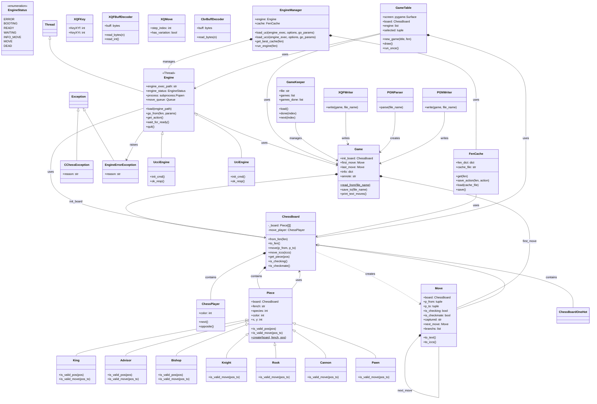

# cchess 类依赖关系图

## 类依赖关系说明

### 核心类层次
1. **ChessBoard（棋盘）**: 核心类，包含棋盘状态和所有棋子
   - 依赖: Piece, Move, ChessPlayer
   
2. **Piece（棋子）**: 抽象基类，所有棋子的父类
   - 依赖: ChessBoard
   - 子类: King, Advisor, Bishop, Knight, Rook, Cannon, Pawn
   
3. **Move（走子）**: 表示一步棋
   - 依赖: ChessBoard
   - 自引用: next_move, branchs（变招）
   
4. **Game（棋局）**: 管理整个棋局，包括初始棋盘和所有走子
   - 依赖: ChessBoard, Move

### 引擎系统
1. **Engine（引擎基类）**: 抽象引擎接口
   - 继承自 Thread
   - 依赖: ChessBoard, Game
   
2. **UcciEngine / UciEngine**: 具体引擎实现
   - 继承自 Engine
   
3. **EngineManager（引擎管理器）**: 管理引擎和缓存
   - 组合: Engine, FenCache
   
4. **FenCache（FEN缓存）**: 缓存棋局评估结果
   - 依赖: ChessBoard

### IO系统
- **XQFWriter / PGNWriter**: 写入棋谱文件
- **PGNParser**: 解析PGN文件
- 都依赖 Game 类

### Demo应用
- **GameTable**: 游戏界面，使用pygame
  - 依赖: ChessBoard, Game, Engine
- **GameKeeper**: 管理多个棋局
  - 依赖: Game

### 异常类
- **CChessException**: 通用异常
- **EngineErrorException**: 引擎相关异常

